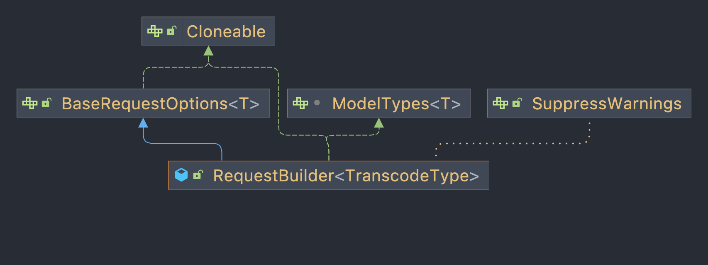
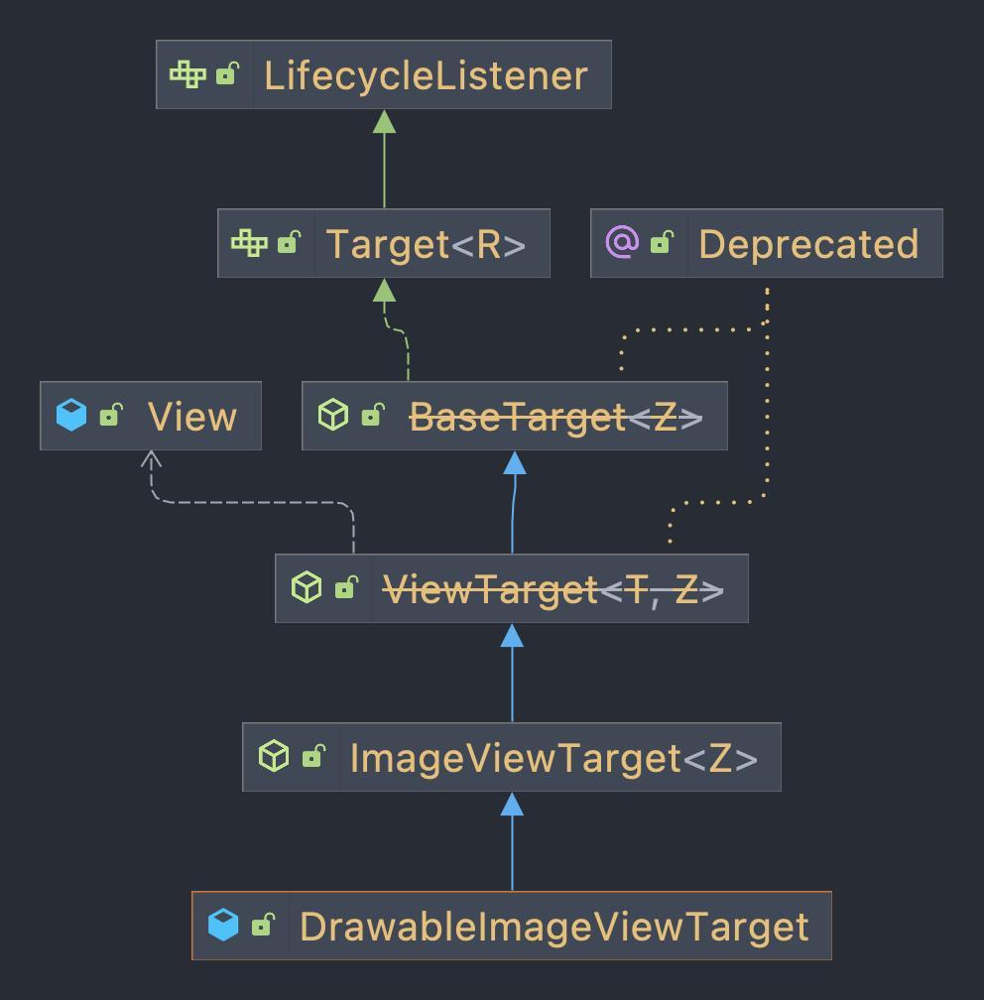

```java
  // RequestManager.java
  // RequestBuilder 泛型参数 TranscodeType Drawble
  public RequestBuilder<Drawable> load(@Nullable String string) {
    return asDrawable().load(string);
  }
```

```java
  // RequestManager.java
  public RequestBuilder<Drawable> asDrawable() {
    return as(Drawable.class);
  }
```

```java
  // RequestManager.java
  // 此时ResourceType即是Drawable
  public <ResourceType> RequestBuilder<ResourceType> as(
      @NonNull Class<ResourceType> resourceClass) {
    return new RequestBuilder<>(glide, this, resourceClass, context);
  }
```



```java
  // RequestManager中保存了RequestOptions、TransitionOptions以及RequestListeners
  // RequestBuilder构造函数中会将RequestManager作为参数传入
  protected RequestBuilder(
      @NonNull Glide glide,
      RequestManager requestManager,
      Class<TranscodeType> transcodeClass,
      Context context) {
    this.glide = glide;
    this.requestManager = requestManager;
    this.transcodeClass = transcodeClass; // Drawable.class
    this.context = context;
    this.transitionOptions = requestManager.getDefaultTransitionOptions(transcodeClass);
    this.glideContext = glide.getGlideContext();

    initRequestListeners(requestManager.getDefaultRequestListeners());
    apply(requestManager.getDefaultRequestOptions());
  }
```

RequestBuilder.into() -> DrawableImageViewTarget



```java
return into(
    /*target=*/ glideContext.buildImageViewTarget(view, transcodeClass),
    /*targetListener=*/ null,
    /*options=*/ requestOptions,
    /*callbackExecutor=*/ Executors.mainThreadExecutor()); // 拉取到网络资源后转到主线程执行setImageDrawable
```

```java
  // SingleRequest
  Request request = buildRequest(target, targetListener /* 此时null */, options, callbackExecutor);
  // buildRequest会给request生成requestLock

  requestManager.track
  ...
  requestTracker.runRequest // requestTracker在RequestManager的构造方法中创建
  ...
  request.begin // request为SingleRequest
```

